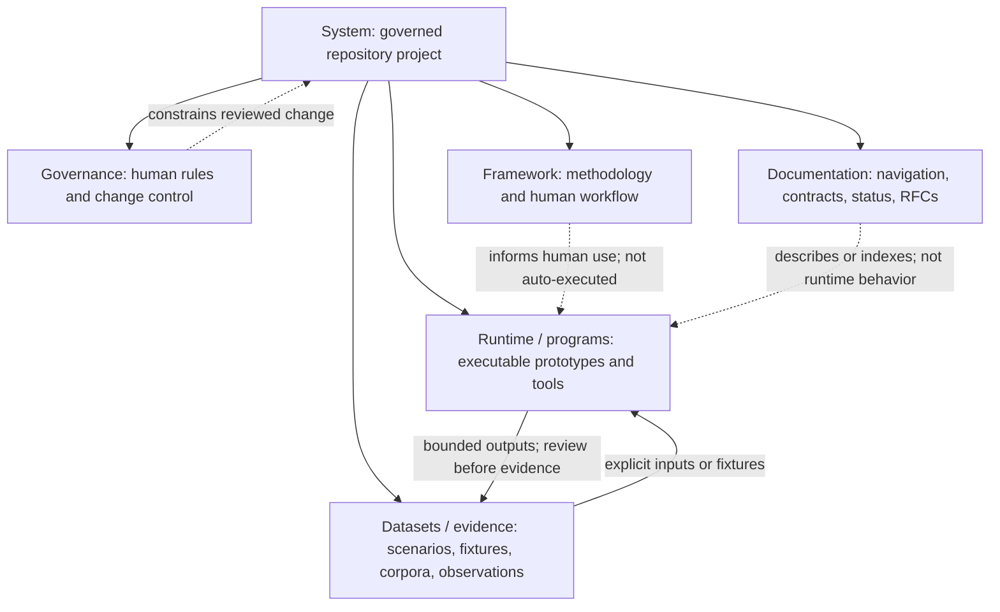

# HUB_Optimus system architecture map

## Purpose and authority

This is a current-state map of the repository tree that contains it. It
separates the overall system, executable programs and runtime contracts, the
broader methodology/framework, documentation, datasets/evidence artifacts, and
governance. It is a navigation aid, not a new implementation contract,
deployment diagram, capability attestation, or roadmap.

For conflicts, apply the
[source-of-truth hierarchy](../context/SOURCE_OF_TRUTH.md). In particular:

- GitHub `main` is authoritative for the versioned repository tree at a named
  commit; live GitHub objects are authoritative only for their own mutable
  state.
- The applicable schemas, source, tests, and
  [runtime contract](runtime_contract.md) define the scenario runtime
  boundary. This map does not redefine it.
- [STATUS.md](../context/STATUS.md) resolves canonical-language and parity
  questions. The v1 methodology is canonical in
  [`v1_core/languages/es/`](../../v1_core/languages/es/).
- Human governance sources live under
  [`docs/governance/`](../governance/). Their translations are mirrors with
  the maturity declared in `docs/i18n/maturity.v1.json`.
- The [capability ledger](capability_status.md) is a derived evidence view, not
  an authority over source, contracts, governance, or live external state.

## Map

The arrows show repository relationships, not network calls. No executable
surface loads the governance or canonical-methodology Markdown as an
autonomous decision policy.

## Category boundaries

The categories classify authority and function, not file extension. Governance
is stored as documentation, for example, but remains separate because its
human normative role differs from explanatory or proposal text.

| Category | Current repository meaning | Representative paths / evidence | Boundary |
| --- | --- | --- | --- |
| **System** | The repository-level project and the rules that relate its versioned artifacts and GitHub records. It is not one executable program. | `docs/context/SOURCE_OF_TRUTH.md`, the derived `docs/context/PROJECT_OVERVIEW.md`, a named GitHub `main` commit, and direct inspection of applicable live GitHub objects | The source-of-truth hierarchy governs; the overview is navigation, and each live object is authoritative only for its own mutable state. A checkout does not attest deployment, repository settings, Releases, or later GitHub activity. |
| **Runtime / programs** | Concrete executable surfaces and their bounded behavior. The supported scenario runtime is one program family; the Semantic Engine CLI, Operator, local operations scripts, and laboratory tools are separate, narrower surfaces. | `scenario.schema.json`, `run_scenario.py`, `hub_optimus_simulator.py`, `semantic_engine/`, `site/operator/`, `ops/ec2/`, `tools/` | Executable presence does not make a surface a public service, a production deployment, or an implementation of the full framework. |
| **Framework / methodology** | Human-readable v1 concepts, scenario workflow, templates, and evaluation method. It is broader than the current programs. | Canonical v1 methodology in `v1_core/languages/es/`; workflow material in `v1_core/workflow/` | Framework descriptions are not executable features. Only the Spanish v1 methodology path has the canonical-language status stated in `STATUS.md`; other copies retain their declared parity or classification status. |
| **Documentation** | Onboarding, context, architecture descriptions, operating notes, translation metadata, and proposals. | Non-governance material under `docs/`, including `docs/context/`, `docs/architecture/`, `docs/i18n/`, and `docs/rfc/` | Documentation can describe, index, constrain, or propose. An RFC does not authorize itself, and a document does not prove its described capability exists. |
| **Datasets / evidence artifacts** | Versioned inputs, dataset/evidence schemas, fixtures, expected outputs, provisional claim corpora, and reproducible synthetic observations. | `scenarios/`, `benchmarks/`, `datasets/`, `docs/lab_regeneration_1775.md`, `docs/architecture/capability_evidence.v1.json` | Status is artifact-specific. Frozen outputs establish deterministic regression behavior; provisional claims and synthetic results are not verified real-world facts, causal evidence, or forecasts. Runtime schemas such as `scenario.schema.json` remain runtime contracts. |
| **Governance** | Human-authored project rules, stewardship, consensus, trust, and change-control records. | `docs/governance/`, `.github/CODEOWNERS`, and applicable traceable decision or ratification records | An Issue or Pull Request does not govern merely because it was reviewed; only an applicable decision or ratification record supplies traceability to the governing text. Governance text is not executable code, AI authority, legal authority, or automatic ratification. Human accountability and GitHub-visible review remain required. |

## Executable surfaces

The term “runtime” must not collapse distinct programs into one capability:

| Surface | Contract and evidence | Implemented boundary |
| --- | --- | --- |
| Scenario CLI and simulator | [Runtime contract](runtime_contract.md), `scenario.schema.json`, `run_scenario.py`, `hub_optimus_simulator.py`, tests, and frozen benchmarks | Strict scenario loading plus a deterministic, simple round-based simulation. Success occurs when any actor action contains an exact key/value match for any configured criterion entry. It does not execute the framework's full structural evaluation method. |
| Semantic Engine CLI | [Semantic Engine CLI contract](semantic_engine_cli.md), `semantic_engine/contracts/`, and `tests/semantic_engine/` | Validates `CaseInput v1` and assembles deterministic review records. It does not evaluate truth, score claims or people, judge with a model, or make decisions. |
| Operator and static site | `site/`, `site/operator/`, and their tests | Browser-side intake and local draft preparation. The current script can post a URL to its fixed controlled-intake endpoint and can generate—but does not execute—a copy/paste command for a separately controlled `/analyze` runtime. The repository does not establish that the endpoint or public site is deployed. Operator drafts are not automatically Semantic Engine output or verified evidence. |
| Local intake and operations | `tools/mobile_ingest.py`, `ops/ec2/`, their contracts, and tests | Local/private intake and manually installed backend helpers with stated limits. They do not establish a public API, managed confidential storage, or a deployed host. |
| Laboratory tools | `tools/scenario_*`, the generator, and applicable tests and regeneration records | Experimental processing of deterministic synthetic scenarios. Outputs do not establish real-world agreement rates, policy quality, or prediction. |

## Source-of-truth relationships

| Question | Direct authority | How the other categories relate |
| --- | --- | --- |
| What is in the repository? | A named commit on GitHub `main` | Maps and overviews summarize that tree; they cannot certify later changes. |
| What does the scenario runtime do? | Applicable schema and source, read with tests and `runtime_contract.md` | Framework and governance documents may set human expectations, but they are not runtime call paths. |
| Which v1 methodology language wins? | `docs/context/STATUS.md` and `v1_core/languages/es/` | English and other copies are parity, translation, or unclassified material as stated by the applicable status record. |
| Which governance text governs? | `docs/governance/` plus its human review and decision record | Translations improve access but do not create alternate governance. |
| What is implemented? | Direct code/contract/test evidence interpreted conservatively | `capability_status.md` is a derived ledger; file presence, prose, or a green unrelated test is insufficient. |
| Is a deployment, Release, setting, PR, or professional review current? | Direct inspection of that live external object at a stated time | The repository can record prior evidence or workflow source, but cannot attest mutable external state by itself. |

## Explicit non-capabilities

Nothing in this map adds or implies:

- autonomous truth adjudication, motive inference, prediction, probabilistic
  forecasting, or general diplomatic evaluation;
- automatic execution of the v1 methodology by the simulator, Semantic Engine,
  Operator, or an AI model;
- HERMES, an enterprise product, a post-quantum control plane, public
  authentication or billing, or a public Semantic Engine service;
- automatic promotion of fetched material, browser drafts, dataset claims, or
  synthetic outputs into verified evidence;
- deployment, repository-settings, release, security, legal, scientific, or
  professional-translation attestation; or
- AI ownership, autonomous governance, self-ratification, or replacement of
  accountable human review.

Use the [project overview](../context/PROJECT_OVERVIEW.md) for the plain-language
boundary and the [capability ledger](capability_status.md) for evidence paths
and status-specific limitations.
