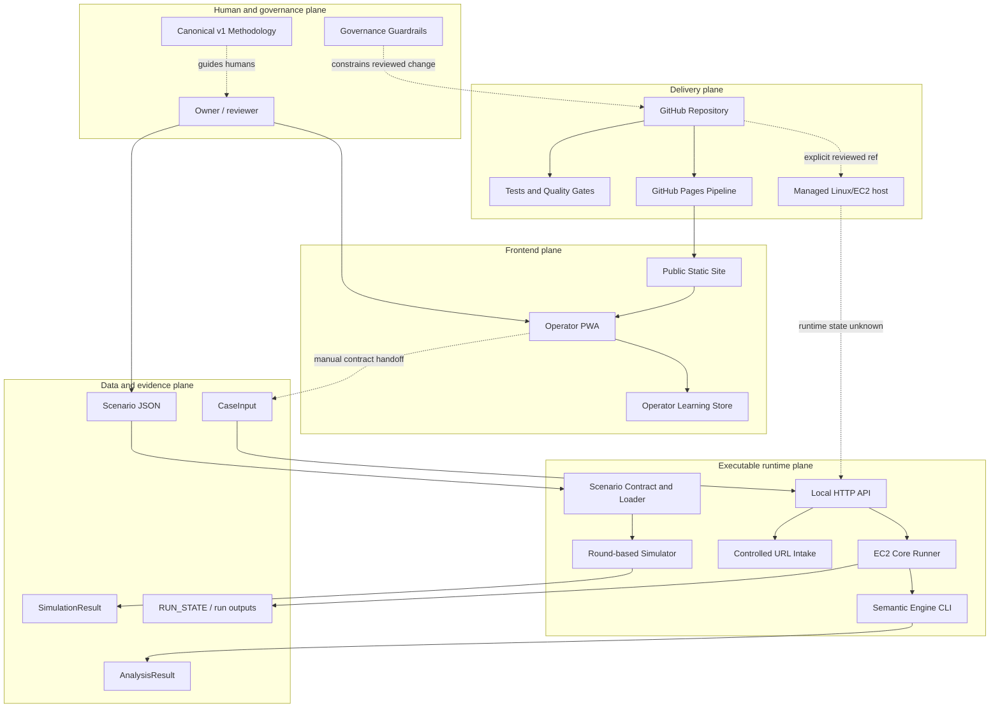

# Architecture Map

## Master Map

## Project

- [[Project Overview]]
- [[Capabilities]]
- [[Limitations]]
- [[Glossary]]

## Frontend

- [[Frontend Architecture]]
- [[Public Static Site]]
- [[Operator PWA]]
- [[Operator Learning Store]]

## Backend

- [[Backend Architecture]]
- [[Scenario Contract and Loader]]
- [[Round-based Simulator]]
- [[Semantic Engine Contracts and CLI]]
- [[Controlled URL Intake]]
- [[Local HTTP API]]

## APIs

- [[Interface Catalogue]]
- [[GET health]]
- [[GET status]]
- [[POST intake url]]
- [[POST analyze]]
- [[Scenario CLI]]
- [[Semantic Engine CLI]]
- [[hub-core CLI]]

## Components

- [[Architecture Overview]]
- [[System Context]]
- [[Runtime Architecture]]
- [[Architecture Data Flow]]
- [[Dependency Graph]]

## Data

- [[Data Architecture]]
- [[Scenario Data Model]]
- [[Semantic Data Model]]
- [[Operator Learning Data]]
- [[Operational Records]]

## Infrastructure

- [[Infrastructure Boundary]]
- [[EC2 Release Operations]]
- [[EC2 Core Runner and Run Registry]]
- [[GitHub Pages Pipeline]]

## Deployment

- [[Deployment Architecture]]
- [[Operations Guide]]

## Security

- [[Security Boundaries]]
- [[Risk Register]]

## Dependencies

- [[Dependencies]]

## Source

- [[Source Map]]
- [[Evidence Index]]
- [[Repository Analysis]]
