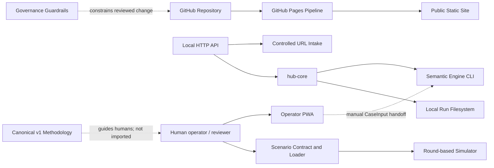

# HUB_Optimus

> Modelo de inteligencia técnica y funcional del repositorio, generado desde el árbol `main` fijado en `30e985226347b4bc59b0e187b96633a09647ca42`. Explica el sistema que emerge del código, los contratos, los tests, las operaciones y la gobernanza; no convierte aspiraciones ni estado externo en capacidades verificadas.

## System Status

- **Repositorio:** `Voxterrae/HUB_Optimus`
- **Baseline:** `30e985226347b4bc59b0e187b96633a09647ca42` · tree `fabb9da1fdb6979df0bc764017752f118088e69f`
- **Naturaleza:** metodología versionada + gobierno humano + prototipos de software acotados.
- **Runtime principal:** Python; superficies públicas estáticas en HTML/CSS/JavaScript.
- **Estado global:** operativo como repositorio y conjunto de prototipos; producto público autenticado y deployment backend permanecen no verificados.
- **Modelo estructurado compartido:** `site/obsidian-HUB_Optimus/system.json`, que declara el fragmento `system.runtime.json` para mantener el payload estático modular.

Véanse [[System Dashboard]] y [[Current State]].

## What This Project Does

HUB_Optimus estructura escenarios, claims, evidence references, incertidumbre, trazabilidad y revisión humana. El árbol contiene:

- un loader y simulador determinista de escenarios;
- contratos y CLI del Semantic Engine;
- un Operator/PWA local-first;
- intake URL y API HTTP local con límites explícitos;
- operaciones manuales de release/rollback para Linux/EC2;
- tooling experimental, datasets, tests y un sitio estático.

La delimitación completa está en [[Capabilities]] y [[Limitations]].

## Architecture

El proyecto no es una sola aplicación. Es un sistema por capas:

Abrir [[Architecture Map]] y [[Architecture Overview]].

## Main Components

- [[Governance Guardrails]]
- [[Canonical v1 Methodology]]
- [[Scenario Contract and Loader]]
- [[Round-based Simulator]]
- [[Semantic Engine Contracts and CLI]]
- [[Operator PWA]]
- [[Controlled URL Intake]]
- [[Local HTTP API]]
- [[EC2 Release Operations]]
- [[Public Static Site]]
- [[Tests and Quality Gates]]

## Runtime Flow

Existen flujos ejecutables separados:

1. **Scenario:** Scenario JSON → validation → Simulator → SimulationResult.
2. **Semantic:** CaseInput → schema + referential integrity → CLI → AnalysisResult.
3. **Local API:** HTTP → strict body → hub-core → Semantic CLI → run registry → response.
4. **Controlled intake:** URL → network validation → bounded fetch/extraction → unreviewed record.

Véase [[Runtime Architecture]].

## Data Flow

Los contratos principales son [[Scenario Data Model]], [[Semantic Data Model]], [[Operator Learning Data]] y [[Operational Records]]. Los borradores del Operator y los resultados de intake no se elevan automáticamente a evidencia verificada.

## Deployment

- **Pages:** el workflow sube directamente `site/`; no existe build frontend.
- **Linux/EC2:** scripts manuales con ref explícito, preflight, provenance y rollback.
- **Estado vivo:** `UNKNOWN` hasta inspeccionar el deployment concreto.

Véase [[Deployment Architecture]].

## Current State

La lectura ejecutiva y operativa está en [[Current State]]. La diferencia central es:

> **CONFIRMED source** no equivale a **CONFIRMED live deployment**.

## Key Risks

- [[Risk Register#Documentation drift|Documentation drift]]
- [[Risk Register#Ambition–implementation gap|Ambition–implementation gap]]
- [[Risk Register#External deployment state|External deployment state]]
- [[Risk Register#Draft mistaken for evidence|Draft mistaken for evidence]]
- [[Risk Register#API exposure boundary|API exposure boundary]]

## Navigation

- [[Navigation]]
- [[System Dashboard]]
- [[Architecture Map]]
- [[Interface Catalogue]]
- [[Data Architecture]]
- [[Security Boundaries]]
- [[Testing Strategy]]
- [[Source Map]]
- [[Repository Analysis]]
