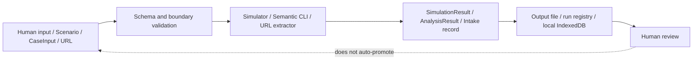

# Architecture Data Flow

## Flow Overview

## Scenario Data

`Scenario JSON` → strict validation → in-memory `Scenario` → per-round action history → `SimulationResult JSON`.

## Semantic Data

`CaseInput` → schema and cross-reference validation → immutable records → `AnalysisResult`.

## Operator Data

Human input → source-bound local draft → human review → optional `LearningCandidate`. El candidate tiene autoridad `local-non-canonical`.

## URL Intake Data

URL → redirect/retrieval metadata + extracted text → record con `verification_status=unreviewed` y `learning_status=candidate-source-not-verified`.

## Operational Data

Ref/commit → release provenance. Command/input → run ID → RUN_STATE + outputs. Los paths son locales al host gestionado y no se publican como dataset.

## Ownership

| Data | Owner / authority |
| --- | --- |
| Scenario source | Autor/revisor humano |
| Simulation output | Artefacto sintético de runtime |
| CaseInput claims/evidence | Fuente y operador humano |
| AnalysisResult | Record assembly; no truth authority |
| Learning candidate | Local human review only |
| Run/release state | Host operation record |
| Governance decision | Human owner / GitHub record |

## Related

- [[Data Architecture]]
- [[Scenario Data Model]]
- [[Semantic Data Model]]
- [[Operator Learning Data]]
- [[Operational Records]]
