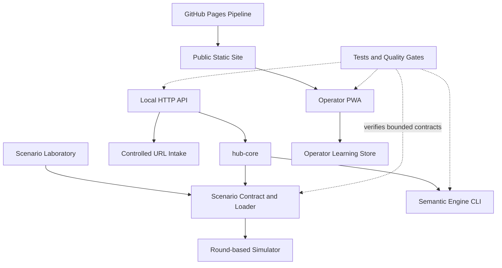
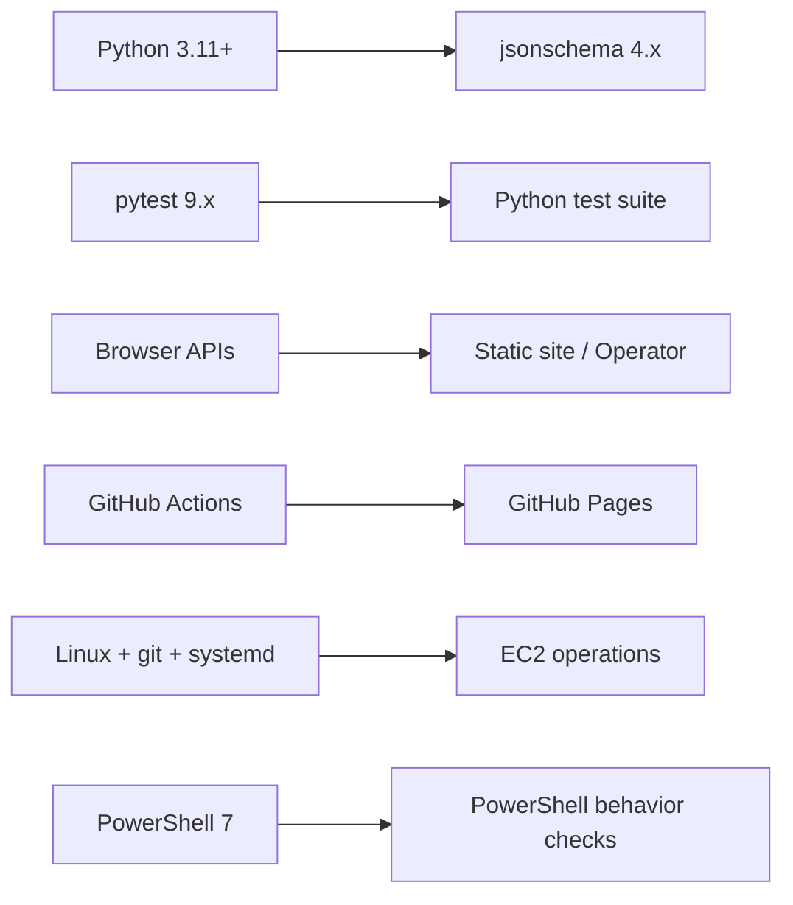

# Dependency Graph

## Internal Dependencies

## External Dependencies

## Isolated Prototype

[[Local Control Prototype]] no es una dependencia del Scenario runtime, Semantic Engine, Operator ni operations. Su relación arquitectónica es aislamiento explícito.

## Dependency Policy

- Runtime Python: `requirements.txt`.
- Development/test: `requirements-dev.txt`.
- No `package.json` ni build frontend.
- No framework JavaScript de grafo añadido.
- GitHub Actions están fijadas por SHA y auditadas.

## Related

- [[Dependencies]]
- [[Testing Strategy]]
- [[Infrastructure Boundary]]
