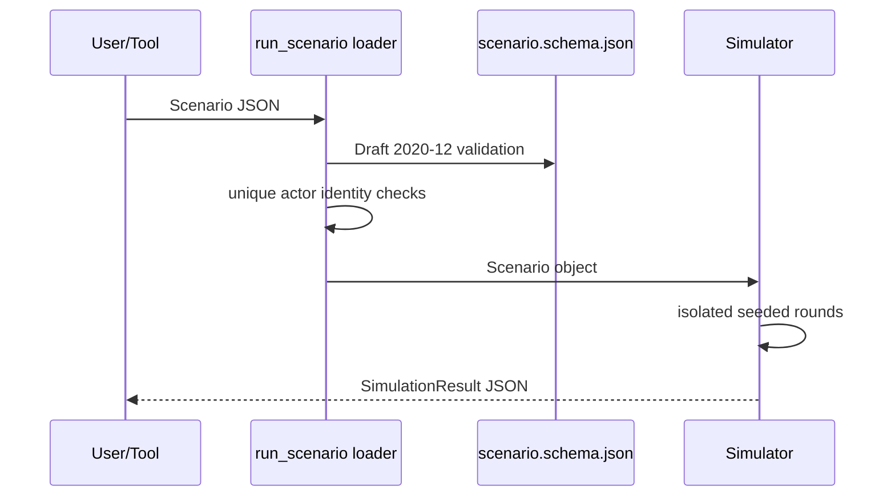
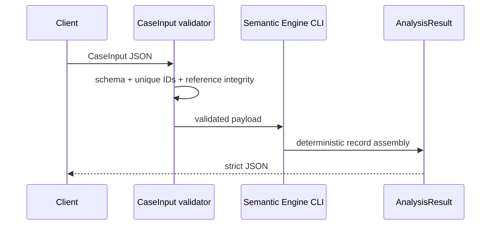
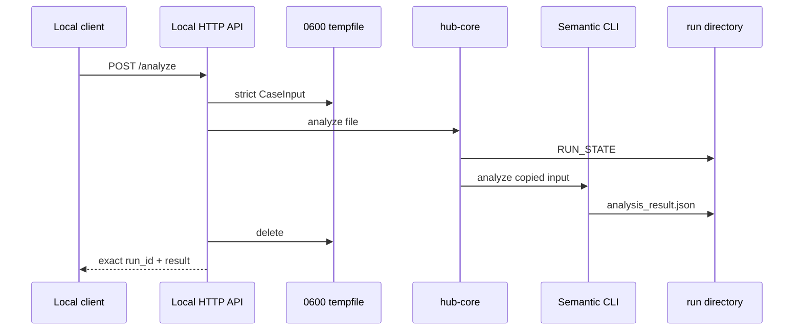

# Runtime Architecture

## Scenario Runtime

Boundary: exact-match success in any actor action; no full methodology execution.

## Semantic Runtime

Boundary: no scoring, truth verdict or model judge.

## Local Analyze Runtime

## Controlled Intake Runtime

URL → URI/DNS/IP validation → pinned connection → bounded response → HTML/text extraction → unreviewed record.

## Browser Runtime

El public site y Operator son estáticos. Operator mantiene trabajo local y puede preparar contratos; la disponibilidad de un backend público no se infiere.

## Related

- [[Scenario CLI]]
- [[Semantic Engine CLI]]
- [[Interface Catalogue]]
- [[Operational Records]]
