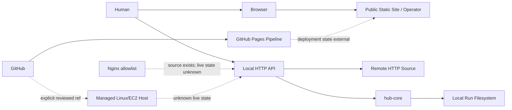

# System Context

## Actors and External Systems

| Actor/system | Role | Status |
| --- | --- | --- |
| Human Operator / Reviewer | Introduce, revisa y autoriza material humano. | `active` |
| Browser | Ejecuta sitio, Operator y Project Intelligence. | `active` |
| GitHub Repository | Fuente versionada y control de cambio. | `active` |
| GitHub Pages Runtime | Sirve `site/`; estado concreto externo. | `unknown` |
| Remote HTTP Source | Fuente del controlled intake; contenido no verificado. | `unknown` |
| Managed Linux/EC2 Host | Host documentado para runtime local. | `unknown` |
| Nginx Allowlisted Proxy | Fuente de configuración para dos rutas públicas. | `partial` |
| Local Run Filesystem | Runs y provenance en host gestionado. | `partial` |

## Context Diagram

## Trust Boundaries

- **Human ↔ Operator:** input puede ser incompleto o erróneo.
- **Operator ↔ local store:** storage del navegador, no servicio administrado.
- **Local API ↔ remote source:** red no confiable; output `unreviewed`.
- **GitHub ↔ deployment:** source/commit no es prueba de estado servido.
- **AI/contributor ↔ owner gate:** implementación no equivale a autorización.

## Related

- [[Security Boundaries]]
- [[Infrastructure Boundary]]
- [[Deployment Architecture]]
