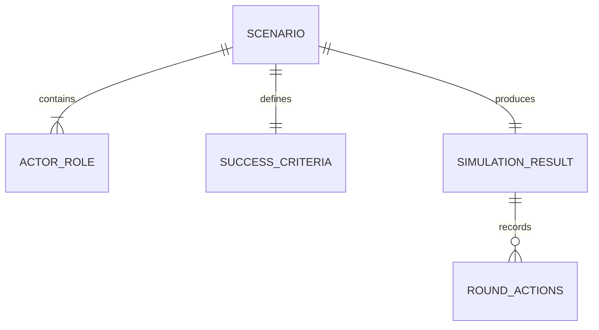

# Scenario Data Model

## Scenario

Required fields:

| Field | Contract |
| --- | --- |
| `title` | Non-empty string |
| `description` | Non-empty string |
| `roles` | Non-empty array of `{name, role}` |
| `success_criteria` | Non-empty object with scalar values |
| `max_rounds` | Integer ≥ 1 |

Unknown fields are rejected. `run_scenario.py` additionally requires unique actor names.

## Runtime Objects

- `Scenario`: validated container.
- `Actor`: name, role type and policy.
- `Simulator.history`: list of per-round actor actions.
- `SimulationResult`: `status`, `rounds`, `history`, `detail`.

## Relationships

## Persistence

Input and output are local JSON files. Benchmarks freeze selected outputs byte-for-byte.

## Ownership and Meaning

Scenario content is authored input. Result status is only a consequence of the simulator’s exact-match rule and assumptions; it is not a real-world outcome claim.

## Source

- `scenario.schema.json`
- `run_scenario.py`
- `hub_optimus_simulator.py`

## Related

- [[Scenario Contract and Loader]]
- [[Round-based Simulator]]
- [[Scenario CLI]]
