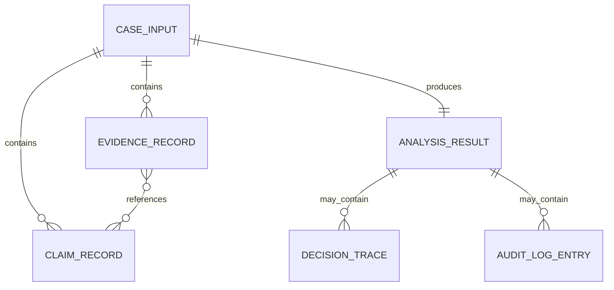

# Semantic Data Model

## CaseInput v1

Required:

- `case_id`
- `core_version_ref`
- `input_summary`

Optional collections and fields:

- `claims`
- `evidence`
- `inferences`
- `uncertainties`
- `narrative_amplification`
- `operational_signal`
- `status`
- `metadata`

Unknown fields are rejected except inside explicit `metadata`, which remains opaque and non-authoritative.

## ClaimRecord

- `claim_id`, `text`, `source_ref`
- optional `claim_type`, `requires_evidence`, `status`, `metadata`

## EvidenceRecord

- `evidence_id`, `text`, `source_ref`
- optional `source_type`, supports/contradicts claim IDs, limitations, metadata

## Cross-record Integrity

- Claim IDs are unique.
- Evidence IDs are unique.
- Every supports/contradicts reference names a submitted claim.
- Input cannot inject output-only decision/audit fields.

## AnalysisResult

```text
case identity
claims
evidence
inferences
uncertainties
narrative amplification
operational signal
status
decision trace
audit log
metadata
```

El CLI mínimo conserva la información enviada y deja decision trace/audit log vacíos salvo que otra capa explícita los construya.

## Relationships



## Related

- [[Semantic Engine Contracts and CLI]]
- [[Semantic Engine CLI]]
- [[POST analyze]]
