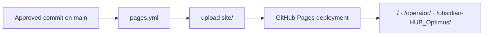
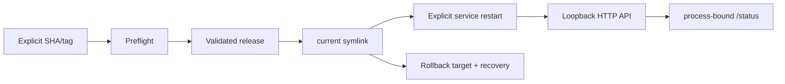

# Deployment Architecture

## GitHub Pages

- No frontend build.
- Workflow source is `active`.
- Each run and served route must be verified externally.
- This change is additive under `site/obsidian-HUB_Optimus/`.

## Managed Linux/EC2

- Deployment and rollback are transactional.
- Process identity is captured at API start.
- Moving `current` without restart cannot make an old process claim the new commit.
- Host state is external.

## Nginx Boundary

The versioned proxy exposes only `/health` and `/intake/url`; `/analyze` and `/status` remain private.

## Rollback for Project Intelligence

Because the new route is additive, rollback is removal/revert of:

- `obsidian-HUB_Optimus/`
- `site/obsidian-HUB_Optimus/`
- `tests/test_project_intelligence_site.py`

No runtime schema, API or existing route must be changed.

## Related

- [[GitHub Pages Pipeline]]
- [[EC2 Release Operations]]
- [[Infrastructure Boundary]]
- [[Operations Guide]]
