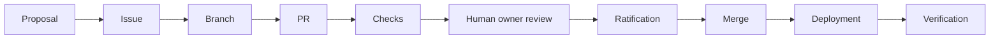

# Decision Record Map

## Governing Decisions and Sources

| Question | Authority |
| --- | --- |
| Who has final human authority? | `docs/governance/FOUNDER_OWNERSHIP_AND_AUTHORITY.md` + owner manifest |
| What is the source-of-truth hierarchy? | `docs/context/SOURCE_OF_TRUTH.md` |
| How should AI/contributors operate? | `AGENTS.md` + handoff records |
| What methodology language is canonical? | `docs/context/STATUS.md` |
| What does the Scenario runtime do? | schema + source + tests + runtime contract |
| What is implemented? | current source/config/tests; derived ledger as secondary snapshot |
| Is a deployment/current setting live? | the external object inspected at a stated time |

## Decision Lifecycle

An AI-created branch/PR is implementation evidence, not ratification.

## Project Intelligence Decision

Issue `#1901` scopes this addition to:

- a new Obsidian graph;
- one `system.json`;
- an isolated Pages route;
- focused static validation;
- no runtime, API, schema, governance or workflow change;
- owner-gated merge.

## Selected History

Véase [[Repository Evolution]].

## Related

- [[Governance Guardrails]]
- [[Repository Analysis]]
- [[Update Protocol]]
